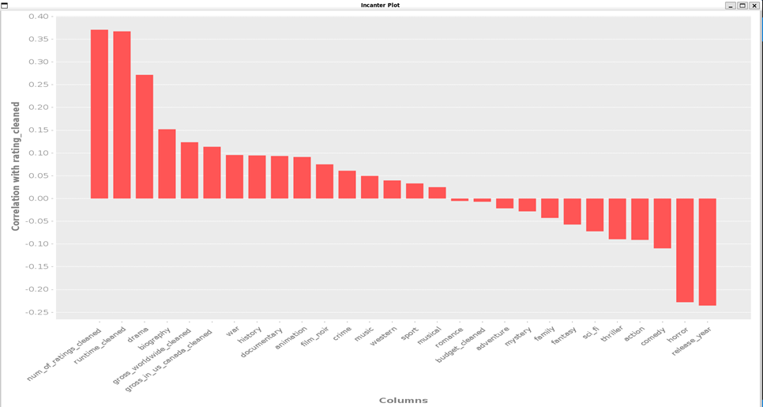
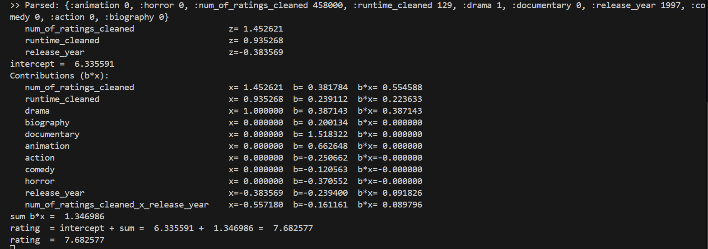

# Project goal

The goal of this project is **to predict a movie’s rating on IMDb**. IMDb is a website that collects user ratings for movies. Those ratings are subjective and depend on many factors.  
The model I use is **linear regression**. In short, it finds coefficients ($\beta$) so that a linear combination of inputs best fits the known ratings:

$$
{y} = \beta_0 + \sum_i \beta_i x_i
$$

The key point is that **all features must be numeric or 0/1** (one-hot encoded categories), so the linear model can work directly.

The data source is the **uncleaned Kaggle IMDbMovies.csv dataset**: <https://www.kaggle.com/datasets/elvinrustam/imdb-movies-dataset>

# Project flow and files
 `cleaning.clj`
1) **CSV analysis and column inspection.**  
2) **Cleaning the CSV** through the following steps:
   1. **Dropping columns** with too many NAs or that are hard to convert into numeric/categorical variables  
      (*Opening-Weekend-Gross-in-US-&-Canada, Summary, Director, Title, Writer, Motion-Picture-Rating*).
   2. **Currency normalization**: all monetary fields (*Budget, Gross-in-US-&-Canada, Gross-worldwide*) are converted to **USD** and parsed to numbers.
   3. **Rating**: strings like `"4.7/10"` are converted to `4.7` (double).
   4. **Runtime**: strings like `"2h12m"` are converted to **minutes** (e.g., `132`) (int).
   5. **Number of ratings**: formats like `"1.2M"` are converted to a plain **double** (`1200000`).
   6. **Genres (Main-Genres)**: converted to **one-hot encoding** — first, detect the set of all genres in the dataset; then, for each movie, set `1` for the genres it has and `0` for the rest.

`cleaning.clj` 
reads the original **IMDBMovies.csv** and the cleaned version is written as **cleanedCSV**.

`imputation.clj`

For the cleaned data, where all columns are numeric or 0/1, **NA values** are filled with the **column mean**.  
From `cleanedCSV` I obtain **finalCleanCSV**.

`dbWork.clj`

Enables importing the **entire finalCleanCSV** dataset into a **SQLite** database.  
The database is stored at **`resources/database.db`**.

In this file, the dataset is also split into train and test sets (see below).

`correlation.clj`

Used for **two purposes**:

1. **Pearson correlation** between the **dependent variable** (*rating*) and the **independent variables** (all the remaining ones after cleaning).  
   Decision: I keep in consideration all variables with **|r| ≥ 0.08**, where **r** is the *Pearson correlation coefficient*.  
   Exception: `gross_worldwide_cleaned` and `gross_in_us_canada_cleaned` - their correlations with *rating* isn't large and they showed **many NAs** early on, so they were **removed** for practical/data-quality reasons.
   

2. **Correlation matrix of predictors (multicollinearity check)**:  
   For the remaining variables  
   *(runtime_cleaned, num_of_ratings_cleaned, drama, biography, war, history, documentary, animation, thriller, action, comedy, horror, release_year)*  
   there are **no pairs with |r| > 0.8**, so all were kept for modeling.

---
**Deterministic split (train/test) - `dbWork.clj`**

The **Movies** dataset is split into **train** and **test** **deterministically**, using a **fixed seed** (this is done with java.util.Random).  
This ensures the same movie always ends up in the same partition - results are **reproducible**.

In the database (`resources/database.db`) the tables are:`movies` - **9,083** rows (all movies),`movies_train` - **7,266** rows (80%), `movies_test` - **1,817** rows (20%)

---

 `lm.clj` - training the model (Incanter linear-model)

1. **Initial version (no normalization/transformations)** on the train set:  
   - **RMSE = 0.84**, **MAE = 0.61**, **R² = 0.36**  
   - **Intercept = 30.42**, which is outside the rating range (ratings go 1–10), so the model is poorly scaled.

2. **Standardizing numeric variables**:  
   `num_of_ratings_cleaned`, `release_year`, and `runtime_cleaned` -> z-scores (`z = (x−μ)/sd`).  
   - The intercept **comes back to a realistic range** (6.4) but other metrics **slightly worsened** .

3. **Filtering by p-values**:  
   Variables with **p > 0.05** were removed (*history* and *thriller*).  
   - Metrics **slightly improved** relative to the previous step 

4. **Adding an interaction**:  
   Added **`num_of_ratings_cleaned x release_year`**.  
   - This brought a **noticeable improvement** over step 3, but then the *War* variable’s p-value increased, so it was removed.  
   - **Final set of variables**:  
     `:num_of_ratings_cleaned, :runtime_cleaned, :drama, :biography, :documentary, :animation, :action, :comedy, :horror, :release_year, :num_of_ratings_cleaned_x_release_year`

**Final metrics: RMSE = 0.8257**, **MAE = 0.59**, **R² = 0.38**  
- While the results are somewhat unsatisfactory, this is expected given the nature of the data. IMDB ratings are subjective and noisy and the model relies only on basic metadata (runtime, year, genres, number of ratings) without richer features (marketing campaigns, cultural context, actor popularity spikes, cast/crew details, plot quality, script...). A simple linear regression was chosen for interpretability, which limits performance but still achieves an average error of less than one rating point on a 1-10 scale

> **Note:** Training was performed on the **train** data, and testing/evaluation exclusively on the **test** data from the database.

---

**`server.clj`** 
Backend that enables predictions based on input features and the saved artifact **`resources/lm-artifact.edn`**. 
When the user submits the form in the frontend, the server logs:
- the parsed input (`Parsed: {...}`),
- standardized numeric features (`z`),
- per-feature contributions (`b*x`),
- `Σ b*x`, the `intercept` and the final predicted `rating` (also returned as JSON, rounded to one decimal).

Example server console trace:

# Other files

- **`core.clj`** - comments and the "evolution of the model work".  
- **`config.clj`** - centralized model configuration: `all-predictors`, `target-col`, `feature-columns`, `final-feature-columns`.   
- **`bench.clj`** - benchmarking for the longest-running analysis functions: `correlations-to-target` and `multicollinear-pairs` from `correlation.clj`.  
- **`test/core_test.clj`** - in total 97 Midje tests validating functions from multiple namespaces.
---
# Libraries Used

This project relies on the following dependencies:

- **Clojure** (`org.clojure/clojure`, v1.11.1) - core language and standard library.  
- **Data Processing**  
  - `org.clojure/data.csv` - reading and writing CSV files.  
  - `cheshire` - JSON parsing and generation.  

- **Database**  
  - `seancorfield/next.jdbc` - JDBC wrapper for Clojure.  
  - `org.xerial/sqlite-jdbc` - SQLite JDBC driver (required by `next.jdbc`).  

- **Web / Server**  
  - `ring/ring-core` - HTTP utilities and middleware.  
  - `ring/ring-jetty-adapter` - runs the Ring app on a Jetty web server so it can handle real HTTP requests.  
  - `ring-cors` - CORS (Cross-Origin Resource Sharing) rules to allow API calls from a separate frontend.  

- **Statistics & Analysis**  
  - `incanter` - statistical functions, linear models and charting.  

- **Testing & Benchmarking**  
  - `midje` - a testing framework for writing readable, expressive unit tests in Clojure.  
  - `criterium` - a benchmarking library that measures execution time accurately for performance-critical functions.  

- **Logging**  
  - `org.slf4j/slf4j-simple` - simple SLF4J binding (helpful for Jetty and Ring logs). 

## License

Copyright © 2024 FIXME

This program and the accompanying materials are made available under the
terms of the Eclipse Public License 2.0 which is available at
http://www.eclipse.org/legal/epl-2.0.

This Source Code may also be made available under the following Secondary
Licenses when the conditions for such availability set forth in the Eclipse
Public License, v. 2.0 are satisfied: GNU General Public License as published by
the Free Software Foundation, either version 2 of the License, or (at your
option) any later version, with the GNU Classpath Exception which is available
at https://www.gnu.org/software/classpath/license.html.
