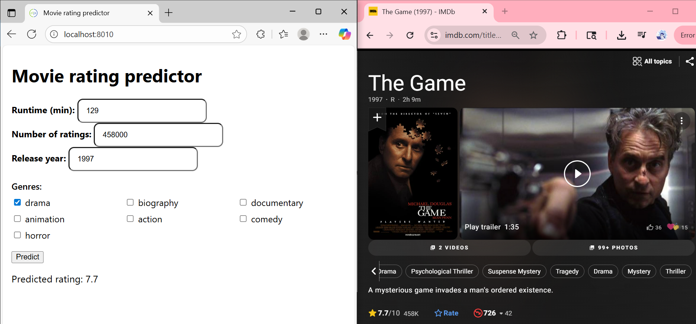
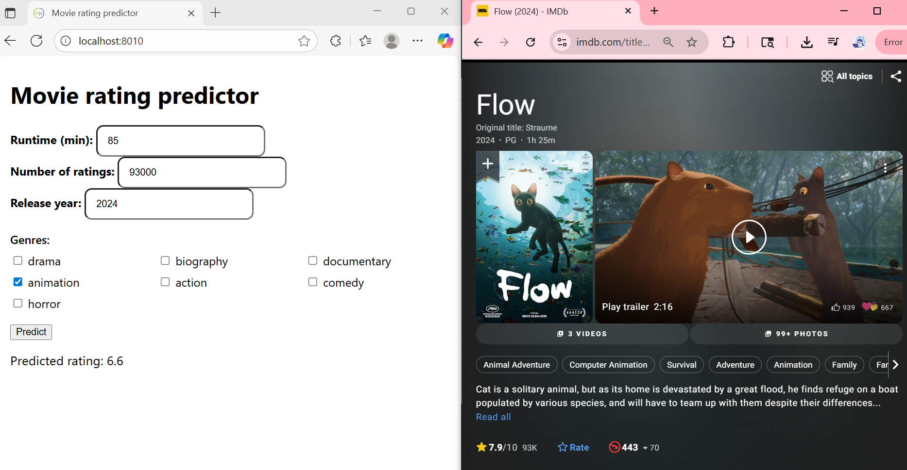

# Project goal

The goal of this project is **to predict a movie's rating on IMDb**. IMDb is a website that collects user ratings for movies. Those ratings are subjective and depend on many factors.  
The model I use is **linear regression**. In short, it finds coefficients ($\beta$) so that a linear combination of inputs best fits the known ratings:

$$
{y} = \beta_0 + \sum_i \beta_i x_i
$$

**Feature format.** All inputs are numeric. Categorical attributes are turned into **binary indicator columns (0/1)**.  
**Target variable.** The output is **continuous** (IMDb rating on a 1–10 scale).

The data source is the **uncleaned Kaggle IMDbMovies.csv dataset**: <https://www.kaggle.com/datasets/elvinrustam/imdb-movies-dataset>

## Motivation

This project was built as a course assignment for **"Tools and Methods of Artificial Intelligence and Software Engineering."**  
I chose movie rating prediction because I genuinely enjoy watching films-and before I hit play, I always check the IMDb score. That habit sparked a question: *how far can we get using only simple, readily available metadata (runtime, release year, genres, number of ratings) to predict a movie's rating?*

IMDb ratings are subjective and noisy, so perfect accuracy isn't realistic here. Still, the project shows a clean, reproducible baseline that can be extended later (e.g., richer text/review features, non-linear models or better feature interactions).


# Project flow and files
 `cleaning.clj`
1) **CSV analysis and column inspection.**  
2) **Cleaning the CSV** through the following steps:
   1. **Dropping columns** with too many NAs or that are hard to convert into numeric/categorical variables  
      (*Opening-Weekend-Gross-in-US-&-Canada, Summary, Director, Title, Writer, Motion-Picture-Rating*).
   2. **Currency normalization**: all monetary fields (*Budget, Gross-in-US-&-Canada, Gross-worldwide*) are converted to **USD** and parsed to numbers.
   3. **Rating**: strings like `"4.7/10"` are converted to `4.7` (double).
   4. **Runtime**: strings like `"2h12m"` are converted to **minutes** (e.g., `132`) (int).
   5. **Number of ratings**: formats like `"1.2M"` are converted to **double** (`1200000`) to support large values.
   6. **Genres (Main-Genres)**: converted to **one-hot encoding**. First, detect the set of all genres in the dataset; then, for each movie, set `1` for the genres it has and `0` for the rest.

`cleaning.clj` 
reads the original **IMDbMovies.csv** and the cleaned version is written as **cleanedCSV**.

`imputation.clj`

For the cleaned data, where all columns are numeric or 0/1, **NA values** are filled with the **column mean**.  
From `cleanedCSV` I obtain **finalCleanCSV**.

`dbWork.clj`

Enables importing the **entire finalCleanCSV** dataset into a **SQLite** database.  
The database is stored at **`resources/database.db`**.

In this file, the dataset is also split into train and test sets (see below).

`correlation.clj`

Used for **two purposes**:

1. **Pearson correlation** between the **dependent variable** (*rating*) and the **independent variables** (all the remaining ones after cleaning).  
   Decision: I keep in consideration all variables with **|r| ≥ 0.08**, where **r** is the *Pearson correlation coefficient*.  
   Exception: `gross_worldwide_cleaned` and `gross_in_us_canada_cleaned` - their correlations with *rating* isn't large and they showed **many NAs** early on, so they were **removed** for practical/data-quality reasons.
   

2. **Correlation matrix of predictors (multicollinearity check)**:  
   For the remaining variables  
   *(runtime_cleaned, num_of_ratings_cleaned, drama, biography, war, history, documentary, animation, thriller, action, comedy, horror, release_year)*  
   there are **no pairs with |r| > 0.8**, so all were kept for modeling.

---
**Deterministic split (train/test) - `dbWork.clj`**

The **Movies** dataset is split into **train** and **test** **deterministically**, using a **fixed seed** (this is done with java.util.Random).  
This ensures the same movie always ends up in the same partition - results are **reproducible**.

In the database (`resources/database.db`) the tables are:`movies` - **9,083** rows (all movies),`movies_train` - **7,266** rows (80%), `movies_test` - **1,817** rows (20%)

---

 `lm.clj` - training the model (Incanter linear-model)

1. **Initial version (no normalization/transformations)** on the train set:  
   - **RMSE = 0.84**, **MAE = 0.61**, **R² = 0.36**  
   - **Intercept = 30.42**, which is outside the rating range (ratings go 1–10), so the model is poorly scaled.

2. **Log-transform skewed counts (`log1p`)**:  
   Apply `log1p(x) = ln(1 + x)` to **`num_of_ratings_cleaned`** to reduce heavy right-skew, **handle zeros** (well-defined even when `x = 0`) and better accommodate **very large vote counts**.

3. **Standardizing numeric variables**:  
     Use z-scores for **`num_of_ratings_cleaned` (log1p-transformed)**, **`release_year`** and **`runtime_cleaned`** -> z-scores (`z = (x−μ)/sd`). Binary genre flags remain 0/1.
   - The intercept **comes back to a realistic range** (6.4) but other metrics **slightly worsened** .

4. **Filtering by p-values**:  
   Variables with **p > 0.05** were removed (*history* and *thriller*).  
   - Metrics **slightly improved** relative to the previous step 

5. **Adding an interaction**:  
   Added **`num_of_ratings_cleaned x release_year`**.  
   - This brought a **noticeable improvement** over step 3, but then the *War* variable's p-value increased, so it was removed.  
   - **Final set of variables**:  
     `:num_of_ratings_cleaned, :runtime_cleaned, :drama, :biography, :documentary, :animation, :action, :comedy, :horror, :release_year, :num_of_ratings_cleaned_x_release_year`

**Final metrics: RMSE = 0.8257**, **MAE = 0.59**, **R² = 0.38**  
- While the results are somewhat unsatisfactory, this is expected given the nature of the data. IMDb ratings are subjective and noisy and the model relies only on basic metadata (runtime, year, genres, number of ratings) without richer features (marketing campaigns, cultural context, actor popularity spikes, cast/crew details, plot quality, script...). A simple linear regression was chosen for interpretability, which limits performance but still achieves an average error of less than one rating point on a 1-10 scale.

> **Note:** Training was performed on the **train** data, and prediction/evaluation exclusively on the **test** data from the database.

---

**`server.clj`** 

Backend that enables predictions based on input features and the saved artifact **`resources/lm-artifact.edn`**. 
When the user submits the form in the frontend, the server logs:
- the parsed input (`Parsed: {...}`),
- standardized numeric features (`z`),
- per-feature contributions (`b*x`),
- `Σ b*x`, the `intercept` and the final predicted `rating` (also returned as JSON, rounded to one decimal).

Example server console trace:

----
**`bench.clj`** 

In order to speed up execution, I benchmarked `correlations-to-target` and `print-multicollinearity` because during runs, these two functions were the slowest parts of the pipeline.
I used **Criterium**, which warms up the JVM and runs the code repeatedly to produce stable timing results (so numbers aren't skewed by JIT or garbage collection).

*Results:*
1) `correlations-to-target`
- **Before:** mean ~ **203.05 ms**
- **After:**  mean ~ **51.50 ms**
- **Speedup:** **~3.9× faster**
2) `print-multicollinearity` (with output suppressed)
- **Before:** mean ~ **5.69 s**
- **After:**  mean ~ **432.37 ms**
- **Speedup:** **~13× faster**

# Other files

- **`core.clj`** - comments and the "evolution of the model work".  
- **`config.clj`** - centralized model configuration: `all-predictors`, `target-col`, `feature-columns`, `final-feature-columns`.    
- **`test/core_test.clj`** - in total 97 Midje tests validating functions from multiple namespaces.
---
# Libraries Used

This project relies on the following dependencies:

- **Clojure** (`org.clojure/clojure`, v1.11.1) - core language and standard library.  
- **Data Processing**  
  - `org.clojure/data.csv` - reading and writing CSV files.  
  - `cheshire` - JSON parsing and generation.  

- **Database**  
  - `seancorfield/next.jdbc` - JDBC wrapper for Clojure.  
  - `org.xerial/sqlite-jdbc` - SQLite JDBC driver (required by `next.jdbc`).  

- **Web / Server**  
  - `ring/ring-core` - HTTP utilities and middleware.  
  - `ring/ring-jetty-adapter` - runs the Ring app on a Jetty web server so it can handle real HTTP requests.  
  - `ring-cors` - CORS (Cross-Origin Resource Sharing) rules to allow API calls from a separate frontend.  

- **Statistics & Analysis**  
  - `incanter` - statistical functions, linear models and charting.  

- **Testing & Benchmarking**  
  - `midje` - a testing framework for writing readable, expressive unit tests in Clojure.  
  - `criterium` - a benchmarking library that measures execution time accurately for performance-critical functions.  

- **Logging**  
  - `org.slf4j/slf4j-simple` - simple SLF4J binding (helpful for Jetty and Ring logs). 

  # How to Run
- **Backend (Clojure):** https://github.com/anndjella/projekat_clojure  
- **Frontend (ClojureScript):** https://github.com/anndjella/IMDB-frontend

## Prerequisites

- **Java JDK**
- **Leiningen**
- **Node.js** and **npm** (for frontend)
1) Clone the repos
```bash
# choose a folder on your machine
cd /your-chosen-folder
# backend
git clone https://github.com/anndjella/projekat_clojure
# frontend
git clone https://github.com/anndjella/IMDB-frontend
```
2) Start the backend

```bash
cd /your-chosen-folder/projekat_clojure
lein run
```
- This starts the Ring/Jetty server on **http://localhost:3000**.
- The project configuration (`:main`) points to your `server.clj`, so the server boots automatically.
- API endpoint: `POST /api/predict` (JSON in, predicted rating out).
3) Start the frontend in the second terminal

```bash
cd /your-chosen-folder/IMDB-frontend
npm install
npx shadow-cljs watch app
```
- Open **http://localhost:8010** in your browser.
- The UI sends `POST` requests to **http://localhost:3000/api/predict**.
> If the backend is not up, the browser console/UI will likely show: `TypeError: Failed to fetch`.
4) Interact

- Enter **runtime** (beween 20 and 400), **number of ratings** (between 1 and 400000), **release year** (between 1900 and 2030), and **genres** in the UI.  
- The predicted rating is displayed if the backend is running and reachable.
5) To run Midje tests (**optional**)
```bash
cd /your-chosen-folder/projekat_clojure
lein midje
```
6) Inspect the SQLite database (**optional**)

You can optionally open the local **SQLite** database for debugging/inspection.

**Database path:** `resources/database.db`

**GUI (DB Browser for SQLite):**
  ```bash
  cd /your-chosen-folder/projekat_clojure
  sudo apt install sqlitebrowser
  sqlitebrowser
  ```

7) Console analysis report (**optional**)

If you switch the entry point from the `server.clj` to the `core.clj`, you'll get a
**console analysis report** (dataset summary, missing values, cleaning/imputation notes, kept features, multicollinearity check, train/test split, evaluation metrics, and model save).

**Switch entry point (project.clj):**
```clojure
;; :main ^:skip-aot projekat.server
:main ^:skip-aot projekat.core
```
### Notes (in Serbian)
I've included my working notes - a narrative of the project's workflow - in
`resources/project-notes-sr` (**in Serbian**).  
They document the end-to-end process: data cleaning choices, feature selection,
model iterations (log1p + standardization, p-values, interactions), benchmarking
with Criterium, and wiring the backend/frontend. They're optional to read, but
they go little deeper into the implementation details and the reasoning behind the final setup.
## Demo (examples)

> **Note on genres:** The UI exposes a small subset of genres (drama, biography, documentary, animation, action, comedy, horror). IMDb has many more; I kept these because they showed the strongest signal and keep the UI simple.

### Example A - "The Game" (1997)

*Prediction:* **7.7**, *IMDb:* **7.7**

The prediction matches the IMDb score because the film combines a large vote count with a near-average runtime and a positive drama indicator, while year and interaction effects are minimal.

---
### Example B - "Flow" (2024)

*Prediction:* **6.6**, *IMDb:* **7.9**.
**Why the miss?**
1) The model uses only basic metadata (runtime/year/genres/votes) - it doesn't "see" reviews, cast/crew or awards-season signals; in this case, Flow is an Oscar-winning title the model can't account for.
2) In my training data, newer release years correlate slightly lower with rating.
3) Shorter runtime and the limited genre palette can **understate appeal** for this title.

This app is an **interpretable baseline** (with β·x contributions in the server log), not a state-of-the-art predictor; it's designed to be transparent and easy to extend.

## License

Copyright © 2024 FIXME

This program and the accompanying materials are made available under the
terms of the Eclipse Public License 2.0 which is available at
http://www.eclipse.org/legal/epl-2.0.

This Source Code may also be made available under the following Secondary
Licenses when the conditions for such availability set forth in the Eclipse
Public License, v. 2.0 are satisfied: GNU General Public License as published by
the Free Software Foundation, either version 2 of the License, or (at your
option) any later version, with the GNU Classpath Exception which is available
at https://www.gnu.org/software/classpath/license.html.
